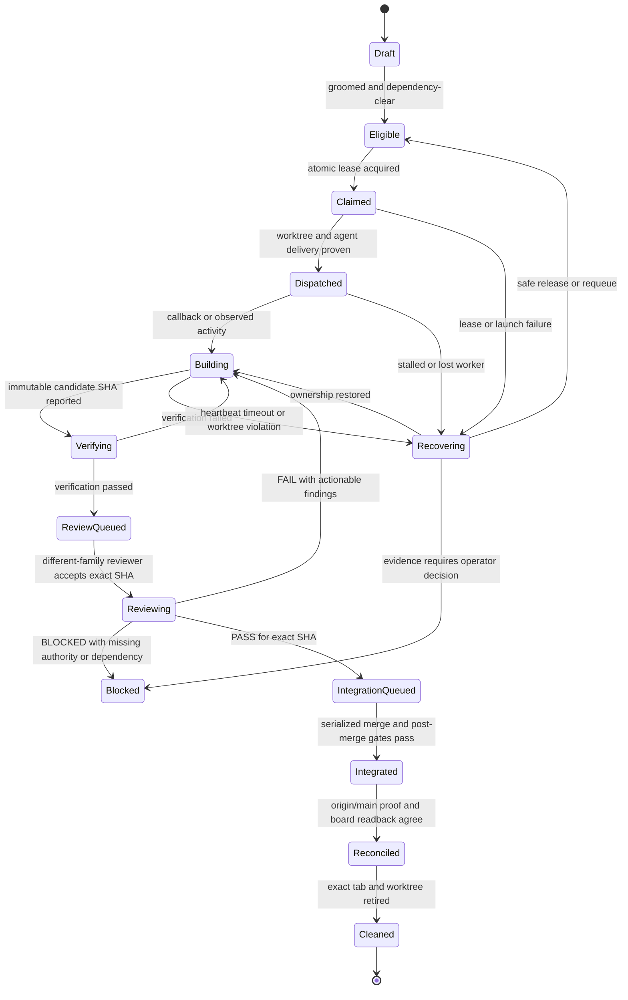

# Herdforge Target Workflow

Status: normative design target; implementation is incomplete.

Herdforge is the repository-local control plane for a software factory. It turns a groomed work queue into verified commits, independent review, serialized integration, and reconciled board state. Herdr is the execution plane that supplies agent sessions, terminal delivery, quota visibility, and process lifecycle.

The governing outcome is stronger than “keep agents busy”:

> Keep every eligible unit of work moving whenever safe capacity exists, while never trading away isolation, evidence, review independence, or recoverability.

This document is the source of truth for the intended workflow. The current implementation delta is recorded in [AUDIT-2026-08-02.md](AUDIT-2026-08-02.md).

## System boundary

Herdforge owns repository and workflow policy:

- task eligibility, dependency, priority, role, and risk rules;
- atomic claims and durable leases;
- task worktrees and immutable revision identities;
- verification and review evidence;
- serialized integration and board reconciliation;
- recovery decisions and audit history.

Herdr owns portable execution mechanics:

- starting, addressing, reading, and closing agent sessions;
- delivering prompts and detecting whether they were consumed;
- provider/model availability and quota posture;
- terminal attention and process-level recovery signals.

Herdforge should compose these capabilities. It should not copy every project-specific `herd-*` shell script or reimplement Herdr’s routing and terminal substrate.

## Durable state machine

The board is an operator view, not the sole transaction log. Every transition is bound to a task ref, lease generation, repository, branch, commit SHA, and evidence set.



No command may skip a state merely because a later state appears plausible. In particular, `in-progress` is not evidence of completion, a clean pane is not evidence of a commit, a reviewer message is not evidence about a different SHA, and a board `done` value is not evidence that work reached `origin/main`.

## Transition contract

| Transition | Required evidence | Writes allowed | Failure behavior |
| --- | --- | --- | --- |
| Draft → Eligible | acceptance criteria, role, risk hint, dependency state, deterministic priority/ref | grooming record | remain Draft |
| Eligible → Claimed | compare-and-set on current board state, capacity token, unique lease generation | claim ledger and board | no dispatch; release or reconcile partial claim |
| Claimed → Dispatched | worktree based on fetched `origin/main`, owned branch/ref, Herdr session started in exact cwd, prompt consumed | worktree, session, outbox receipt | Recovering; never strand silently |
| Building → Verifying | committed candidate SHA, clean owned worktree, task ref in commit evidence | completion event | return to Building |
| Verifying → ReviewQueued | configured commands pass, non-vacuity/mutation evidence where required, result bound to SHA | verification artifact | return to Building with evidence |
| ReviewQueued → Reviewing | reviewer family differs from author family for R1–R3, exact SHA/patch ID accepted | review lease | retain queue; never fall back to same family |
| Reviewing → IntegrationQueued | structured PASS bound to SHA, risk tier, reviewer family, and verification artifact | append-only review ledger | FAIL returns to Building; unknown is Blocked |
| IntegrationQueued → Integrated | shared-checkout lock, clean/rebased candidate, PASS still matches SHA, post-merge gates pass | default branch through one integration owner | keep durable candidate ref; never mark done |
| Integrated → Reconciled | candidate content proven on `origin/main`, board mutation succeeds, readback agrees | board status/comment | retry idempotently |
| Reconciled → Cleaned | no unique commits or dirty files, durable audit refs retained as policy requires | exact session/worktree removal | defer cleanup |

## Work harvesting and scheduling

“No idle work” means no eligible work waits while all of these are true:

1. a compatible execution surface is healthy;
2. a role-appropriate capacity token is free;
3. dependencies and review caps allow the task to advance;
4. resource and budget headroom are above policy thresholds;
5. the work can be isolated safely.

The scheduler is capacity-driven, not a fixed three-stage conveyor belt. It maintains separate pools for builders, deterministic verifiers, independent reviewers, and the single integration lane. It uses:

- completion and failure callbacks for immediate backfill;
- a settle-driven watcher for state changes;
- a slower reconciliation sweep as a safety net;
- bounded concurrency and review/merge backpressure;
- deterministic selection by `(priority DESC, ticket number ASC)` after eligibility filtering.

Polling alone is insufficient. Callbacks can be lost, so polling cannot be eliminated; it becomes reconciliation rather than the primary trigger.

## Board contract

A card is dispatchable only when it has:

- an observable outcome and acceptance criteria;
- a role label or an explicit role mapping;
- a risk hint or enough scope to classify risk before claim;
- explicit dependencies and blocker state;
- a stable ticket ref;
- an operator-owned priority;
- no unresolved duplicate or already-integrated evidence.

Unlabeled or empty-description cards remain Draft even if their board column says To Do. The scout-planner may propose grooming changes, but it does not silently invent product priority or acceptance criteria.

Provider status names are normalized internally. The canonical lifecycle values are `to-do`, `in-progress`, `in-review`, and `done`; provider adapters translate as needed.

## Claim, event, and recovery model

Claims require cross-process fencing, not only an in-memory mutex. A claim record contains at least:

```text
task_ref, repository_id, role, owner, lease_generation,
claimed_at, expires_at, board_revision, state, last_event_sequence
```

All external mutations use a durable outbox and idempotency key. A crash between board mutation, local persistence, session launch, or prompt delivery is therefore detectable and replayable. The next reconciliation pass can complete or compensate the partial transition.

Events are append-only and monotonically sequenced per task. Consumers reject stale callbacks from a previous lease generation or a candidate SHA that has already been superseded.

## Worktree and revision rules

- Each coding task gets an owned, ephemeral worktree created from a fetched, immutable `origin/main` commit.
- The Herdr tab is launched with that worktree as its actual cwd; a prompt instruction to `cd` is not isolation.
- The branch/ref recorded in the task packet must be the real Git branch/ref.
- A durable ref protects every candidate commit before any cleanup or recovery action.
- The shared checkout is coordinator/integration-only and guarded technically.
- Agents may not remove sibling worktrees, rewrite unowned refs, or merge their own work.
- Review and verification operate on an exact SHA, not a moving branch name.

## Verification and review

Verification is a deterministic gate, not an LLM opinion. It records command, exit status, duration, environment policy, and artifact digest against the candidate SHA. Empty commands fail. Quoted commands must be represented safely rather than split with shell-like guessing. Negative assertions and required mutation checks must demonstrate that an introduced regression is actually detected.

Risk policy:

| Tier | Typical scope | Gate |
| --- | --- | --- |
| R0 | documentation, comments, purely mechanical metadata | deterministic verification; mechanical review may be allowed by policy |
| R1 | tests, low-risk refactors, bounded behavior changes | different-family review |
| R2 | features, providers, workflow/state changes | different-family review plus integration rerun |
| R3 | auth, secrets, destructive operations, core orchestration, infrastructure | security-capable different-family review and explicit high-risk gates |

An R1–R3 reviewer may never share the author’s model family. Execution backend, provider account/pool, model, and model family are separate facts. If independence cannot be proven, review waits; the router does not degrade to self-review.

The verdict schema includes:

```text
task_ref, candidate_sha, patch_id, risk_tier, verdict,
author_family, reviewer_family, verification_digest,
findings, reviewed_at, reviewer_identity
```

Valid verdicts are `PASS`, `FAIL`, and `BLOCKED`. Approval is invalid if the candidate SHA, patch ID, verification digest, or risk tier no longer matches.

## Fleet roster

Long-lived control roles and ephemeral task roles should be separated.

| Role | Lifetime | Authority | Must not do |
| --- | --- | --- | --- |
| Orchestrator | standing | coordinate capacity and transitions | author changes, review, or merge |
| Scout-planner | standing or periodic | groom/rank eligible work and identify dependencies | claim or invent priority |
| Builder / smith | ephemeral per task | implement and commit in owned worktree | merge, self-review, or mutate board lifecycle |
| Verification gate | ephemeral per candidate | run deterministic gates and attest evidence | repair code or issue review verdict |
| Reviewer | ephemeral per candidate | adversarial review of exact SHA | edit, merge, or review same-family work |
| Review supervisor | standing | route completion through verify/review queues | author or supply verdicts |
| Integration/harvest owner | single standing lease | serialize merge, reconcile board, and clean up | integrate without matching evidence |
| Recovery sentinel | standing or periodic | detect stalls, lost callbacks, lease expiry, and root bleed | guess success or delete unique work |

Spawn-ready role contracts live in `.herd/prompts/`. Model assignment remains a runtime routing decision; prompts do not hardcode a single cheap model for every role.

## Control-loop pseudocode

```text
on event or reconciliation tick:
  ingest new events idempotently
  reconcile board, claim ledger, sessions, refs, and origin/main
  recover expired or contradictory states before claiming more work
  advance every task whose next gate has evidence and capacity
  fill verifier and reviewer capacity before expanding builder pressure
  serialize eligible integrations
  backfill free builder capacity from deterministically sorted eligible tasks
  emit health, pressure, and blocked-reason metrics
```

This loop never assumes that a command succeeded because it printed a friendly message. Non-zero exits, error-bearing HTTP bodies, unknown provider state, missing receipts, and mismatched revisions are hard failures.

## Definition of operational readiness

Herdforge is ready for unattended multi-repository use when the following are demonstrated in crash/restart and concurrency tests:

- two processes cannot claim the same task;
- a crash at every transition can be reconciled without losing or duplicating work;
- no builder starts in the shared checkout;
- a same-family or stale-SHA review cannot reach integration;
- board `done` cannot precede `origin/main` proof;
- unique dirty or committed work cannot be reaped;
- callbacks immediately backfill capacity and missed callbacks are recovered;
- unlabeled or under-specified cards are never dispatched;
- every error path exits non-zero or records an explicit blocked state;
- the same engine works across providers through tested adapters rather than provider-specific CLI assumptions.
